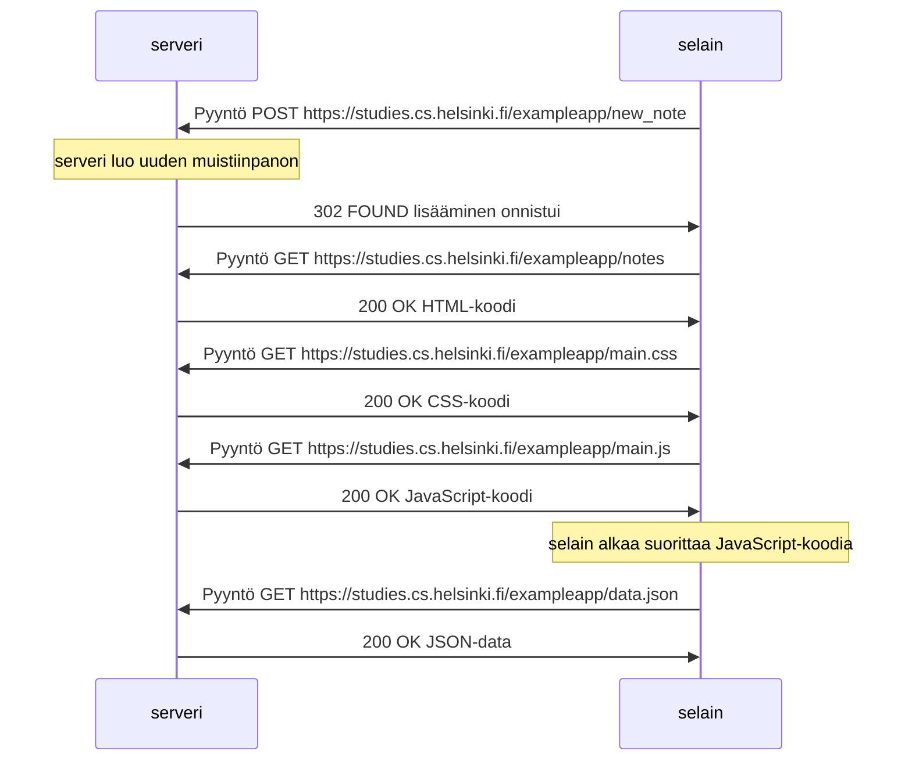

```mermaid
sequenceDiagram
    participant serveri
    participant selain

    selain->>serveri: Pyyntö POST https://studies.cs.helsinki.fi/exampleapp/new_note
    note over serveri: serveri luo uuden muistiinpanon
    serveri->>selain: 302 FOUND lisääminen onnistui

    selain->>serveri: Pyyntö GET https://studies.cs.helsinki.fi/exampleapp/notes
    serveri->>selain: 200 OK HTML-koodi

    selain->>serveri: Pyyntö GET https://studies.cs.helsinki.fi/exampleapp/main.css
    serveri->>selain: 200 OK CSS-koodi

    selain->>serveri: Pyyntö GET https://studies.cs.helsinki.fi/exampleapp/main.js
    serveri->>selain: 200 OK JavaScript-koodi
    note over selain: selain alkaa suorittaa JavaScript-koodia


    selain->>serveri: Pyyntö GET https://studies.cs.helsinki.fi/exampleapp/data.json
    serveri->>selain: 200 OK JSON-data
    
```